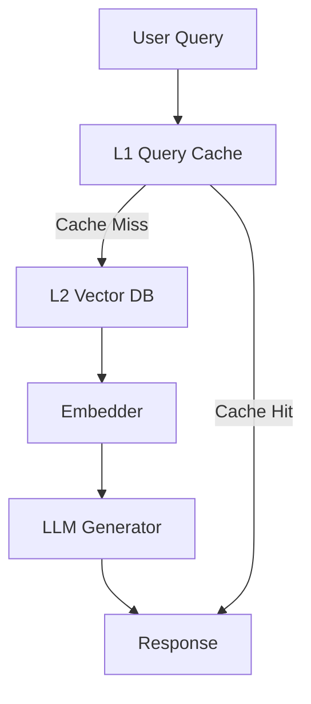

# Scaling Retrieval-Augmented Generation (RAG) Pipelines for Production Search and Chat Applications

_By Rehan Malik | Senior AI/ML Engineer_

---

### TL;DR

- Retrieval-Augmented Generation (RAG) pipelines combine powerful search capabilities with generative AI to deliver factual and context-aware outputs.
- Scaling RAG for customer-facing apps requires careful orchestration to minimize latency (<200ms retrieval + <2s generation), optimize costs, and ensure reliability with high throughput.
- Best practices include **hybrid retrieval**, **streaming generation**, and **dynamic prompt construction** to balance accuracy and speed.
- Real-world architectures leverage **vector databases (e.g., Pinecone, Qdrant)** and **multi-tier cache optimization** to handle millions of documents efficiently.

---

## Introduction

As conversational AI and intelligent search systems are increasingly deployed in production environments, **Retrieval-Augmented Generation (RAG)** has emerged as a pivotal paradigm. Unlike pure generative models, which may hallucinate or produce irrelevant answers, RAG grounds responses in retrieved documents, enabling **factual accuracy** and **domain-specific adaptability**.

Consider this: OpenAI's GPT-4 costs ~$0.06 per 1k tokens. For customer-facing applications generating millions of queries daily, this cost can skyrocket. The challenge is clear: **how do we operationalize RAG to deliver low-latency, high-reliability responses at scale while managing costs effectively?**

This article provides an architectural blueprint and actionable best practices for scaling RAG in production-grade search and chat applications.

---

## Prerequisites

Before diving into architecture, ensure the following tools and knowledge are available:

- **Python 3.8+**  
- **Vector Database**: Pinecone or Qdrant  
- **LLM API**: OpenAI GPT-4, Cohere, or local models like LLaMA 2  
- **Embeddings Model**: OpenAI `text-embedding-ada-002` or Hugging Face `sentence-transformers`  
- **Frameworks**: LangChain, FastAPI, Flask, or Django for orchestration  
- Basic understanding of **retrieval models** (BM25, dense embeddings) and **LLM prompting**

---

## Technical Deep Dive: Building a RAG Pipeline

Let’s walk through the essential components of a scalable RAG pipeline.

### 1. Setting Up the Document Store

To achieve fast and accurate retrieval, we use a **vector database**. This database stores embeddings (dense vector representations of documents) and supports efficient similarity search.

```python
# Install necessary libraries
# pip install openai pinecone-client sentence-transformers

import os
import pinecone
from sentence_transformers import SentenceTransformer

# Initialize embedding model
embedder = SentenceTransformer('all-MiniLM-L6-v2')

# Initialize Pinecone vector database
PINECONE_API_KEY = os.environ['PINECONE_API_KEY']
pinecone.init(api_key=PINECONE_API_KEY, environment="us-west1-gcp")
index_name = "rag-production"
index = pinecone.Index(index_name)

# Ingest documents into the vector database
documents = [
    {"id": "doc1", "text": "The Eiffel Tower is located in Paris, France."},
    {"id": "doc2", "text": "The Great Wall of China was built to protect against invasions."},
]

# Generate and store embeddings
for doc in documents:
    embedding = embedder.encode(doc["text"]).tolist()
    index.upsert([(doc["id"], embedding, {"text": doc["text"]})])

print("Documents ingested into Pinecone!")
```

**Lessons Learned:**  
- **Batch uploads**: For large datasets, use batch upserts with parallel processing to minimize document ingestion time.
- **Index tuning**: Choose the right distance metric for similarity search (e.g., cosine similarity for embeddings like `all-MiniLM-L6-v2`).

---

### 2. Implementing Retrieval and Prompt Construction

Once the document store is populated, we query it for relevant snippets based on user input and craft prompts for the LLM.

```python
# Function to retrieve relevant documents
def retrieve_documents(query, top_k=3):
    query_embedding = embedder.encode(query).tolist()
    results = index.query(query_embedding, top_k=top_k, include_metadata=True)
    return [match["metadata"]["text"] for match in results["matches"]]

# Function to construct a prompt
def construct_prompt(query, context_docs):
    context = "\n".join([f"Document {i+1}: {doc}" for i, doc in enumerate(context_docs)])
    return f"""
    Answer the question based on the following documents:
    {context}

    Question: {query}
    Answer:
    """

# Example usage
user_query = "Where is the Eiffel Tower located?"
retrieved_docs = retrieve_documents(user_query)
prompt = construct_prompt(user_query, retrieved_docs)

print("Constructed Prompt:")
print(prompt)
```

**Lessons Learned:**  
- **Dynamic prompt construction**: Always tailor the prompt to the retrieved documents. Static prompts lead to poor grounding.  
- **Top-k tuning**: `top_k` should balance accuracy and latency. For FAQs, 3-5 documents often suffice; for complex queries, increase to 10-20.  
- **Query preprocessing**: Remove stop words or use query expansion techniques to improve retrieval performance.

---

### 3. Efficient Generation

LLM inference is the most expensive and time-consuming stage of the pipeline. Optimize this step using the following strategies:

#### Parallel Retrieval and Streaming Generation

Instead of waiting for retrieval to finish before starting generation, we can pipeline these operations. While the first documents are retrieved, token generation begins, reducing end-to-end latency.

**Blueprint:**  
```mermaid
graph TD;
    A[User Query] --> B[Retriever (Vector DB)]
    B --> C[Streaming Generation (LLM)]
    C --> D[Response]
```

#### Example Code: Async Retrieval + Streaming Generation

```python
import openai
import asyncio

# OpenAI API Key
OPENAI_API_KEY = os.environ["OPENAI_API_KEY"]
openai.api_key = OPENAI_API_KEY

async def async_retrieve_generate(query, top_k=3):
    loop = asyncio.get_event_loop()
    # Step 1: Retrieve documents concurrently
    retrieved_docs = await loop.run_in_executor(None, retrieve_documents, query, top_k)

    # Step 2: Construct prompt
    prompt = construct_prompt(query, retrieved_docs)

    # Step 3: Generate response
    response = await loop.run_in_executor(None, openai.Completion.create, 
                                          engine="text-davinci-003", 
                                          prompt=prompt, 
                                          max_tokens=150)
    return response["choices"][0]["text"]

# Example usage
async def main():
    user_query = "Tell me about the Eiffel Tower."
    response = await async_retrieve_generate(user_query)
    print("Response:")
    print(response)

# Run async function
asyncio.run(main())
```

**Lessons Learned:**  
- **Streaming APIs**: Use LLM APIs with streaming output (e.g., OpenAI’s `stream=True`) for real-time application responsiveness.  
- **Batch generation**: Batch multiple queries in a single API call for cost savings in high-throughput scenarios.  
- **Caching responses**: Cache frequent queries/responses using Redis or Memcached to reduce redundant calls.

---

### 4. RAG in Production: Best Practices for Scalability

#### **A. Architectural Considerations**
Scale RAG pipelines using layered caching, efficient retrievers, and distributed orchestration.

**Layered Architecture:**
- **L1 Cache**: Frequently accessed queries (e.g., Redis).  
- **L2 Cache**: Document embeddings (e.g., vector database with approximate nearest neighbor).  
- **Compute Layer**: Embedder + LLM for non-cached queries.  

**Blueprint:**  


#### **B. Latency Optimization**
- **Vector Search Tuning**: Use quantization and sparse-dense hybrid indices for low-latency retrieval (<100ms).  
- **Pipeline Parallelism**: Overlap retrieval and generation stages.  
- **Token Limit Management**: Dynamically truncate retrieved documents to fit the token limit of the generator.

#### **C. Cost Management**
- **Model Selection**: Use smaller embedding models (e.g., `text-embedding-ada-002`) and fine-tuned LLMs for specific domains.  
- **Batch Processing**: Handle multiple queries together for bulk inference discounts.  
- **Autoscaling**: Use serverless deployment (e.g., AWS Lambda, GCP Cloud Functions) for cost scaling during peak traffic.

---

## Key Takeaways

1. **Hybrid Retrieval**: Combine sparse and dense retrieval to balance accuracy and performance.  
2. **Streaming Generation**: Use streaming APIs to reduce latency and improve user experience.  
3. **Caching Strategies**: Layered caching can cut costs and improve throughput for frequent queries.  
4. **Dynamic Prompting**: Tailor prompts to retrieved context for better grounding and factuality.  
5. **Monitoring & QA**: Use monitoring tools (e.g., Prometheus) to ensure pipeline reliability at scale.

---

## Further Reading

- [Facebook AI’s RAG Paper](https://arxiv.org/abs/2005.11401)  
- [OpenAI Embeddings Documentation](https://platform.openai.com/docs/guides/embeddings)  
- [Pinecone Documentation](https://docs.pinecone.io/)  
- [LangChain RAG Tutorials](https://docs.langchain.com/docs/usecases/retrieval-augmented-generation)

---

<!-- 
<script type="application/ld+json">
{
  "@context": "https://schema.org",
  "@type": "TechArticle",
  "headline": "Scaling Retrieval-Augmented Generation (RAG) Pipelines for Production Search and Chat Applications",
  "author": {
    "@type": "Person",
    "name": "Rehan Malik"
  },
  "datePublished": "2023-10-19"
}
</script>
-->