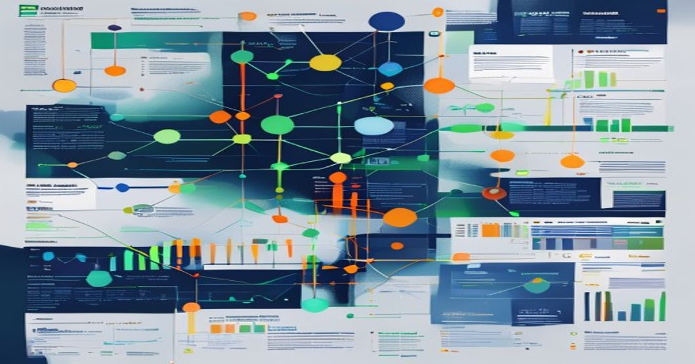

# Multi-Agent LLM Financial Trading Framework: Architecture and Real-World Challenges



---

## TL;DR

- Multi-agent LLM frameworks for trading are promising, but deploying them in production introduces challenges in performance, reliability, and safety.
- Successful systems combine LLMs with deterministic rule-based frameworks, streaming data infrastructure, and high-performance execution layers.
- Key challenges include managing LLM hallucinations, mitigating latency issues, and ensuring robust agent coordination.
- Tools like Ray, Kubernetes, and optimized model serving pipelines are essential components for real-world deployment.

---

## Prerequisites

This framework is built with the following tools:

- Python 3.10+
- PyTorch 2.x or HuggingFace Transformers >=4.38
- Ray >=2.6 for multi-agent orchestration
- Kafka or a similar streaming data feed setup
- OpenAI GPT-4 or open-source models like Llama-2/CodeLlama for local testing
- Docker (optional, for containerization)

---

## Why Multi-Agent LLM Trading Systems Matter Right Now

Financial markets generate massive volumes of high-frequency data, which require real-time analysis and decision-making. Single-agent LLM solutions may offer smart insights for specific sub-problems like sentiment analysis or financial forecasting, but they often struggle with tasks requiring ultra-low latency, scalability, or domain-specific expertise.

Breaking the workflow into a system of specialized agents, each trained or programmed for a specific role, addresses these shortcomings. Multi-agent frameworks are particularly well-suited for trading tasks such as:

- **Macro analysis**: Analyzing economic indicators.
- **News sentiment analysis**: Extracting sentiment from breaking news headlines.
- **Risk management**: Adjusting exposure based on market volatility.
- **Order execution**: Sending buy/sell orders to brokers with stringent latency requirements.

The multi-agent approach enables modularity, fault isolation, and easier debugging. These systems are already being prototyped and deployed using technologies like AutoGen, Ray, and Kubernetes. But transforming them into reliable, always-on production systems is much harder than it might appear in academic papers or demos.

---

## Technical Deep Dive: Building Blocks and Code Examples

Here's a minimal but realistic prototype of a multi-agent LLM trading system. I'll use Ray to orchestrate agents and HuggingFace for LLM processing.

### 1. Simulating a Market Data Stream

First, I need a source of real-time market data. In production, you'd use Kafka, Kinesis, or exchange APIs. For this demo, I'll simulate market events using a Python thread and a queue.

```python
import random
import time
import threading
from queue import Queue

def mock_market_data_feed(q, symbols, interval=0.2):
    while True:
        symbol = random.choice(symbols)
        price = round(random.uniform(90, 110), 2)
        q.put({"symbol": symbol, "price": price, "timestamp": time.time()})
        time.sleep(interval)

market_data_q = Queue()
symbols = ["AAPL", "GOOG", "MSFT"]

data_thread = threading.Thread(target=mock_market_data_feed, args=(market_data_q, symbols), daemon=True)
data_thread.start()
```

This code simulates a real-time feed of stock prices for three symbols.

---

### 2. LLM-Based Analyst Agent

This agent analyzes market data and generates trading signals. For simplicity, I'm using a HuggingFace pipeline. In production, you'd fine-tune models, optimize prompts, and improve parsing logic.

```python
from transformers import pipeline

llm = pipeline("text-generation", model="distilgpt2") # Replace with a faster or fine-tuned model.

def analyst_agent(market_event):
    prompt = (
        f"You are a trading analyst. Given the market event: {market_event}, "
        "output one of: [BUY, SELL, HOLD] and provide a rationale."
    )
    completion = llm(prompt, max_new_tokens=30)[0]['generated_text']
    signal = "HOLD"
    if "BUY" in completion: 
        signal = "BUY"
    elif "SELL" in completion: 
        signal = "SELL"
    return {"signal": signal, "reason": completion}
```

This agent processes market events into simplistic signals like BUY, SELL, or HOLD, alongside basic reasoning.

---

### 3. Multi-Agent Coordination with Ray

Ray lets me scale agents as independent processes, enabling distributed execution. Here's how I wire up the analyst and execution agents.

```python
import ray

ray.init(ignore_reinit_error=True)

@ray.remote
class ExecutorAgent:
    def execute(self, signal, event):
        if signal == "BUY":
            print(f"[Executor] Buying {event['symbol']} at {event['price']}")
        elif signal == "SELL":
            print(f"[Executor] Selling {event['symbol']} at {event['price']}")
        else:
            print(f"[Executor] No action on {event['symbol']}")

executor = ExecutorAgent.remote()

def main_loop():
    while True:
        event = market_data_q.get()
        analysis = analyst_agent(event)
        ray.get(executor.execute.remote(analysis["signal"], event))
        time.sleep(0.1) # Simulate delay.

if __name__ == '__main__':
    main_loop()
```

This setup connects the analyst agent to the executor. In production, I'd use additional agents, such as a compliance checker, risk manager, and order router.

---

## Architecture in Practice: Describing the Full Stack

Here's what the architecture looks like in a broader context:

```
[Market Data Stream] --> [Data Preprocessing Layer]
                                |
                                v
                     [Agent Orchestrator (Ray/K8s)]
                                |
    ---------------------------------------------------------
    | | | | |
[Macro Analyst] [News Sentiment] [Risk Manager] [Execution] [Rule-Based Logic]
    | | | | |
    ---------------------------------------------------------
                                |
                                v
                      [Trade Execution Engine]
                                |
                                v
                       [Order Management System]
                                |
                                v
                        [Exchange/Broker API]
```

- **Preprocessing Layer**: Cleans incoming data, handles schema normalization, and flags outliers.
- **Orchestrator**: Manages lifecycle and communication between agents using Ray or Kubernetes.
- **Specialized Agents**: Each one focuses on a domain-specific task (e.g., macro analysis, sentiment extraction).
- **Execution Engine**: Ensures trades meet risk and compliance checks.
- **Order Management**: Handles live orders efficiently.

---

## Lessons Learned from Real-World Deployments

1. **LLMs are not inherently trustworthy.** They frequently hallucinate outputs, which need strict validation layers in production.
2. **Latency matters more than you think.** LLMs are orders of magnitude slower than traditional rule-based systems, even with optimizations. For latency-sensitive tasks, deterministic logic is still king.
3. **Distributed systems complexity is real.** Multi-agent systems often suffer from synchronization issues. Invest heavily in message reliability and resiliency mechanisms.
4. **Model optimization is essential.** Quantize and distill LLMs for faster inference, especially for memory-heavy models.
5. **Test in live environments before deployment.** Backtesting is not enough; real-time shadow trading helps uncover edge cases, such as changes in market behavior.

---

## Takeaways

- Multi-agent LLM trading frameworks offer modularity and collaboration but face challenges in scalability and reliability.
- LLMs are powerful yet imperfect tools requiring extensive validation and optimization for production.
- Always prioritize latency and safety-critical operations with deterministic, low-latency algorithms.

---

## Further Reading

- [KineticSim: A Lightweight, High-Performance Execution Engine for Real-Time Market Simulators](http://arxiv.org/abs/2606.21784v2)
- [Agentic Time Machine as an Infrastructure for Future-Event Forecasting](http://arxiv.org/abs/2606.21013v1)
- [Plan Before You Trade: Inference-Time Optimization for RL Trading Agents](http://arxiv.org/abs/2605.12653v1)

---

By Rehan Malik

<!-- <script type='application/ld+json'>{"@context":"https://schema.org","@type":"TechArticle","headline":"Multi-Agent LLM Financial Trading Framework: Architecture and Real-World Challenges","author":{"@type":"Person","name":"Rehan Malik"},"datePublished":"2024-07-05"}</script> -->
